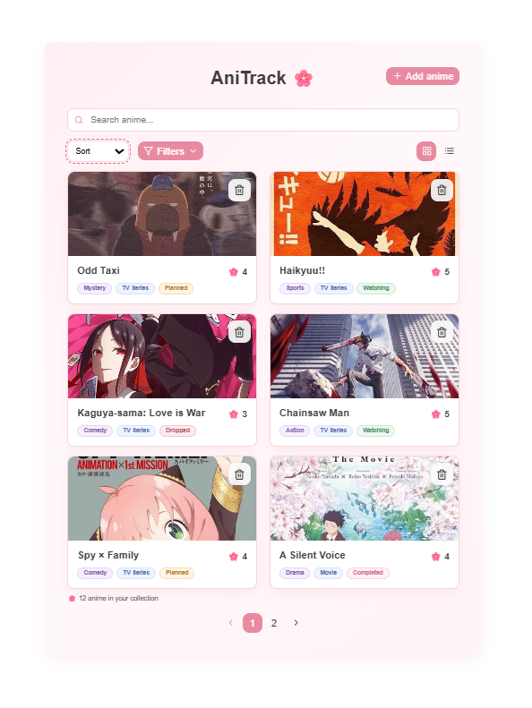
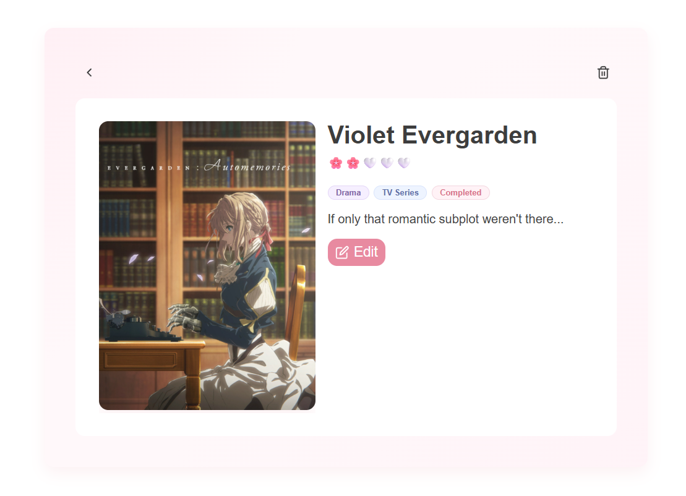
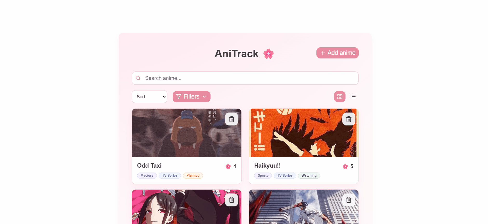

# 🌸 AniTrack

AniTrack is a pet project for tracking your personal anime collection with ratings, custom posters and notes.

🔗 Live Demo: https://ani-track-jade.vercel.app/

## Preview

### Main page

### Anime details

### Adding anime

## Features

- ➕ Add, edit and delete anime
- 🖼 Upload custom posters
- ⭐ Rate anime with sakura flowers
- 📝 Save personal notes
- 🔍 Search by title
- 🎛 Filter by genre, type and status
- ↕ Sort by title, rating or date added
- 📄 Pagination
- 📱 Responsive layout
- ☁ Store data and images in Supabase
- 💾 Save preferred view mode in Local Storage

## What I practiced

- React Hooks
- Custom React hooks
- CRUD operations
- REST API integration (Supabase)
- File upload and Supabase Storage
- URL search parameters
- Reusable modal components
- Pagination, filtering and sorting
- Local Storage
- Responsive UI
